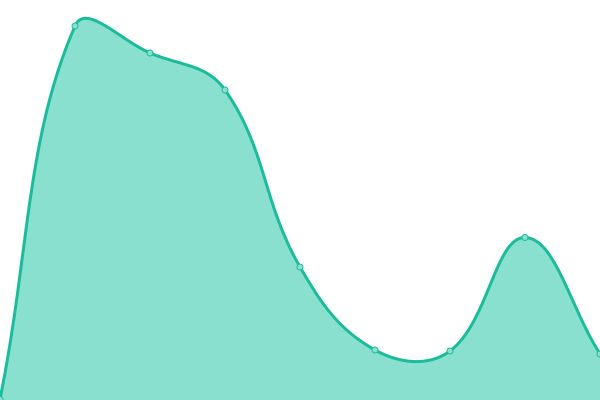
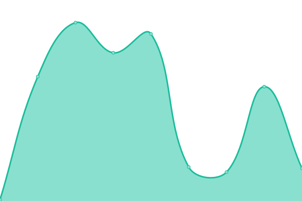

# [📈 Live Status](https://johndavidge.github.io/status-page): <!--live status--> **🟧 Partial outage**

This repository contains the open-source uptime monitor and status page for [John Davidge](https://johndavidge.github.io/status-page), powered by [Upptime](https://github.com/upptime/upptime).

With [Upptime](https://upptime.js.org), you can get your own unlimited and free uptime monitor and status page, powered entirely by a GitHub repository. We use [Issues](https://github.com/johndavidge/status-page/issues) as incident reports, [Actions](https://github.com/johndavidge/status-page/actions) as uptime monitors, and [Pages](https://johndavidge.github.io/status-page) for the status page.

<!--start: status pages-->
<!-- This summary is generated by Upptime (https://github.com/upptime/upptime) -->
<!-- Do not edit this manually, your changes will be overwritten -->
<!-- prettier-ignore -->
| URL | Status | History | Response Time | Uptime |
| --- | ------ | ------- | ------------- | ------ |
|  Vulnerability Feed | 🟩 Up | [vulnerability-feed.yml](https://github.com/johndavidge/status-page/commits/HEAD/history/vulnerability-feed.yml) | 

 940ms
     
 | 

<a href="https://johndavidge.github.io/status-page/history/vulnerability-feed">99.75%</a>
    

|  ClamAV Feed | 🟩 Up | [clam-av-feed.yml](https://github.com/johndavidge/status-page/commits/HEAD/history/clam-av-feed.yml) | 

 119ms
     
 | 

<a href="https://johndavidge.github.io/status-page/history/clam-av-feed">99.75%</a>
    

|  KEV Feed | 🟥 Down | [kev-feed.yml](https://github.com/johndavidge/status-page/commits/HEAD/history/kev-feed.yml) | 

 62ms
     
 | 

<a href="https://johndavidge.github.io/status-page/history/kev-feed">0.00%</a>
    

<!--end: status pages-->

[**Visit our status website →**](https://johndavidge.github.io/status-page)

## 📄 License

- Powered by: [Upptime](https://github.com/upptime/upptime)
- Code: [MIT](./LICENSE) © [Anand Chowdhary](https://anandchowdhary.com), supported by [Pabio](https://pabio.com)
- Data in the `./history` directory: [Open Database License](https://opendatacommons.org/licenses/odbl/1-0/)
